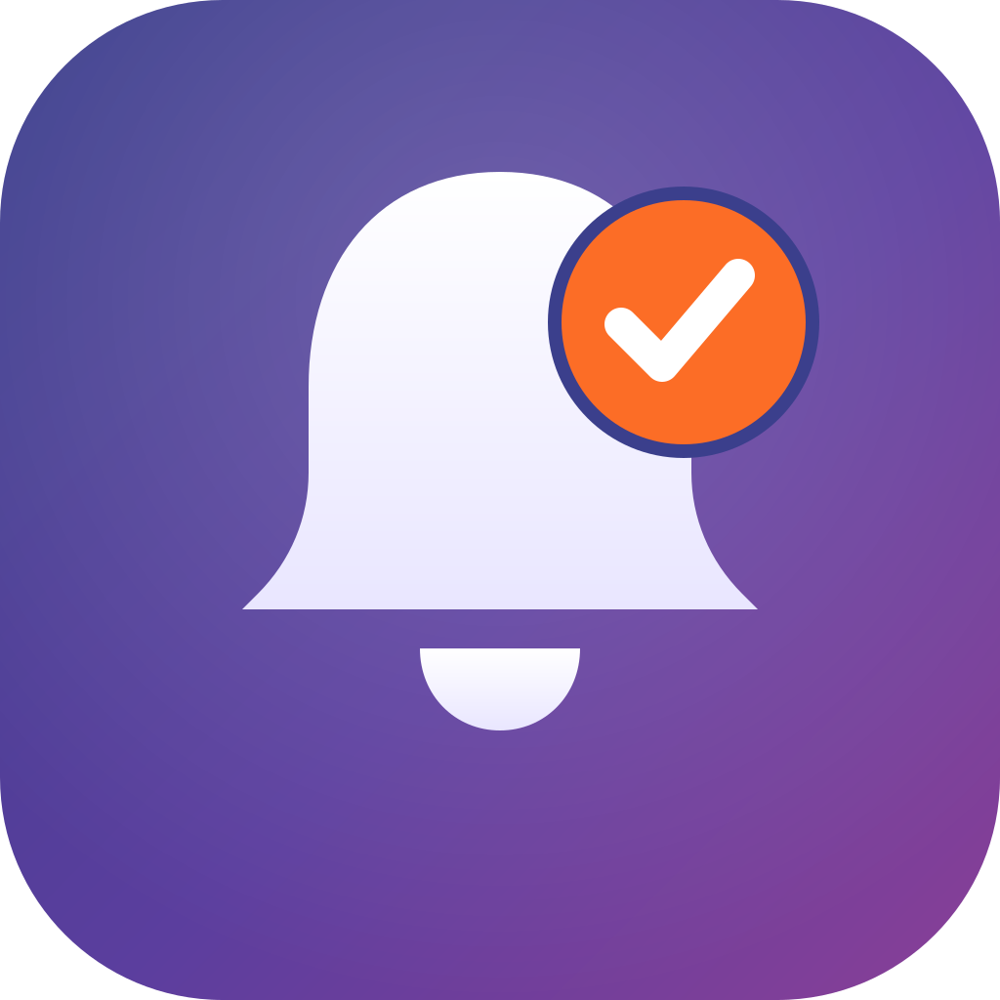
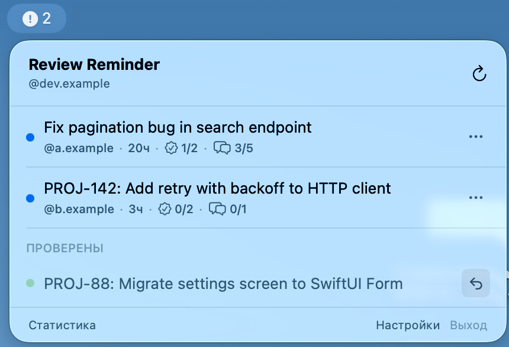
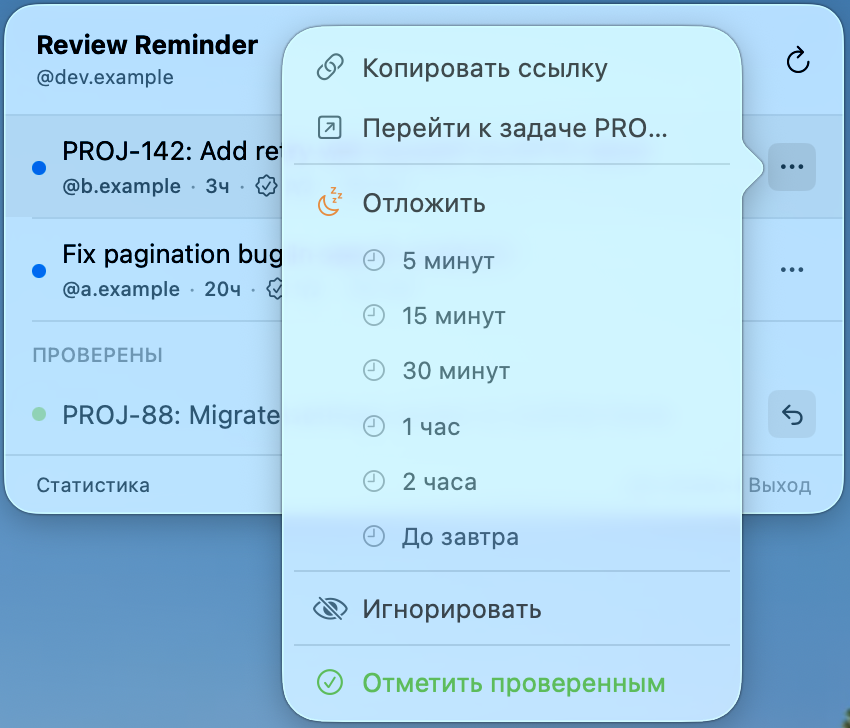
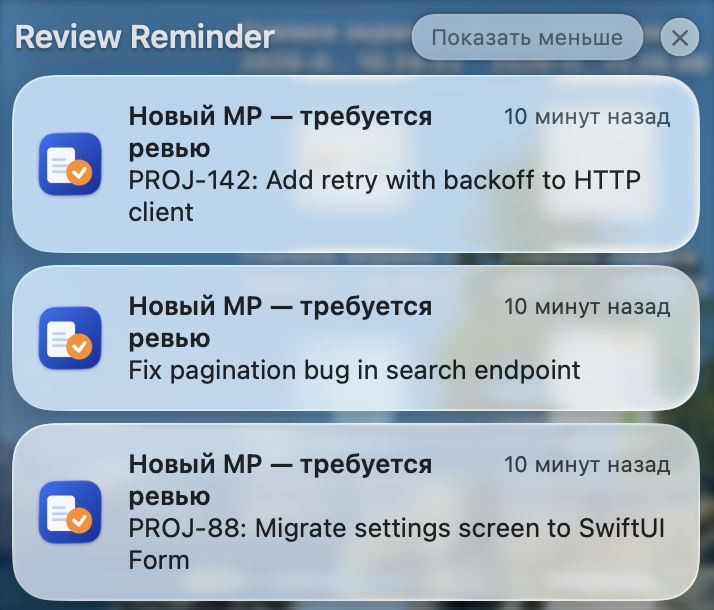
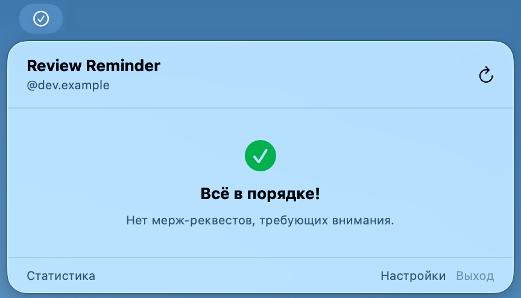
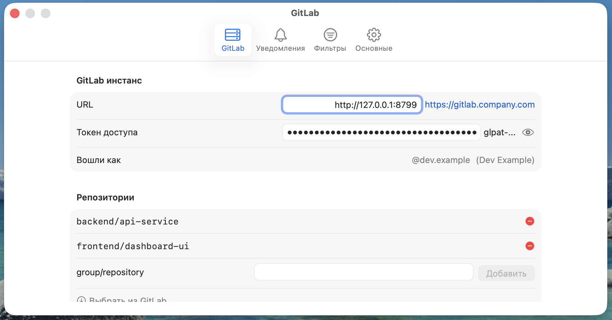
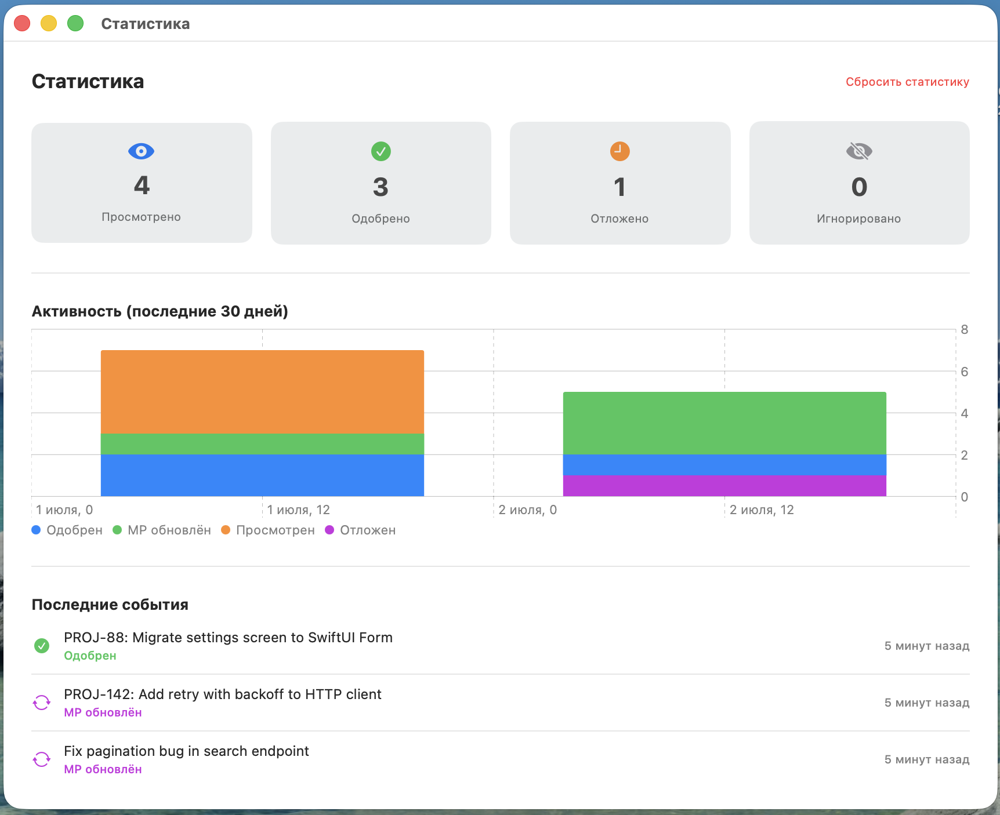

<p align="center">
  
</p>

<h1 align="center">ReviewReminder</h1>

<p align="center"><i>Чтобы МР не залёживались в очереди на ревью.</i></p>

<p align="center">
  
  
  
</p>

Приложение для трея macOS, которое следит за открытыми merge request'ами в GitLab и напоминает, когда вас ждёт ревью.
Живёт в строке меню (без иконки в Dock), периодически опрашивает GitLab API и показывает системные уведомления о
новых МР, изменениях в уже открытых МР и упоминаниях `@username` в комментариях.

## Зачем

GitLab не напомнит сам, если МР висит без ревью третий день — уведомление о назначении разово прилетит и потеряется
среди остальных. ReviewReminder держит открытые МР перед глазами в строке меню, считает, сколько их ждёт вас прямо
сейчас, и присылает системное уведомление, если очередь не разбирается слишком долго.

## Возможности

- Список открытых МР по нескольким репозиториям, сгруппированный по проекту
- Фильтр: «все МР без вашего ревью» или «только назначенные вам»
- Счётчик апрувов (`1/2`) и счётчик разрешённых обсуждений (`3/5`) прямо в списке
- Системные уведомления: новый МР, изменение существующего (новый коммит), упоминание в комментарии
- Периодическое напоминание, если есть непросмотренные МР (якорится на время появления самого старого pending МР,
  не сбрасывается на каждом опросе, переживает сон/выключение машины)
- Отложить МР на время (5 мин / 15 мин / 30 мин / 1 час / 2 часа / до завтра) или проигнорировать
- Approve МР прямо из приложения, без перехода в браузер
- Автоматическая отметка «проверено», когда набрано нужное количество апрувов
- Переход к тикету трекера задач по ссылке, распознанной в заголовке МР (настраиваемый regex и base URL)
- Игнорирование МР по меткам (labels)
- Исключение черновиков/WIP
- Статистика активности по дням (Swift Charts)
- Токен GitLab хранится только в системном Keychain
- Параллельные запросы к GitLab с ограничением на количество одновременных соединений и retry с backoff при 429/5xx

## Интерфейс

<p align="center">
  
</p>

<p align="center">
  
</p>

<p align="center">
  
</p>

<p align="center">
  
</p>

<p align="center">
  
</p>

<p align="center">
  
</p>

## Требования

- macOS 14 Sonoma или новее
- Доступ к GitLab по сети (VPN, если нужен)
- Xcode Command Line Tools (`xcode-select --install`) — для сборки без полного Xcode
- [go-task](https://taskfile.dev) (`brew install go-task`) — опционально, для использования команд `task ...`
- Apple Developer account **не требуется** (используется ad-hoc подпись)

## Установка

### Вариант 1 — сборка без Xcode (только Command Line Tools)

```bash
task install-swift
```

или вручную, без go-task:

```bash
swift build -c release
bash Scripts/install.sh
```

Скрипт соберёт бандл `.app`, подпишет его ad-hoc подписью, скопирует в `~/Applications` и запустит.

### Вариант 2 — сборка через Xcode (если установлен полный Xcode)

```bash
task setup     # установка xcodegen, генерация .xcodeproj
task install   # сборка Release + установка + запуск
```

### Готовый .app

```bash
unzip ReviewReminder.zip -d ~/Applications/
xattr -rd com.apple.quarantine ~/Applications/ReviewReminder.app
open ~/Applications/ReviewReminder.app
```

Подробности и вариант распространения готового `.app` — в [DISTRIBUTION.md](DISTRIBUTION.md).

## Настройка

После первого запуска иконка появится в строке меню.

1. Нажать на иконку → **Настройки**
2. Вкладка **GitLab**:
   - **URL** — адрес инстанса GitLab, например `https://gitlab.example.com`
   - **Токен доступа** — Personal Access Token с правами `read_api` (хранится в Keychain)
   - **Репозитории** — пути проектов (`group/project`), можно выбрать из списка через «Выбрать из GitLab»
3. Вкладка **Уведомления** — включить/выключить системные уведомления и периодические напоминания
4. Вкладка **Фильтры** — режим показа МР, исключение черновиков, игнор-список меток
5. Вкладка **Основные** — интервал опроса, запуск при входе в систему, переход к трекеру задач
6. Нажать **Сохранить** — приложение сразу выполнит первый опрос

### Создание токена в GitLab

GitLab → аватар → **Edit profile** → **Access Tokens** → **Add new token**

- Scopes: `read_api`
- Expiration: по желанию

## Команды разработки

```bash
task setup           # установка xcodegen, генерация .xcodeproj
task open             # генерация проекта и открытие в Xcode
task release           # сборка Release .app с ad-hoc подписью
task install           # сборка + копирование в ~/Applications + запуск (нужен Xcode)
task install-swift     # сборка + установка без Xcode (SwiftPM + Scripts/install.sh)
task clean              # удаление build/ и .xcodeproj
```

Подробнее об архитектуре — в [CLAUDE.md](CLAUDE.md).

## Данные приложения

- База данных (SQLite/GRDB): `~/Library/Application Support/ReviewReminder/reviewer.sqlite`
- Токен GitLab: системный Keychain (`com.reviewreminder`)
- Настройки: `UserDefaults`

## Удаление

```bash
pkill -x ReviewReminder 2>/dev/null
rm -rf ~/Applications/ReviewReminder.app
rm -rf ~/Library/Application\ Support/ReviewReminder   # опционально: БД и события
```

## Технологии

- Swift 6, strict concurrency
- SwiftUI, Swift Charts
- GRDB.swift (SQLite)
- GitLab REST API v4

## Changelog

Список изменений — в [CHANGELOG.md](CHANGELOG.md).

## License

MIT — см. [LICENSE](LICENSE).
